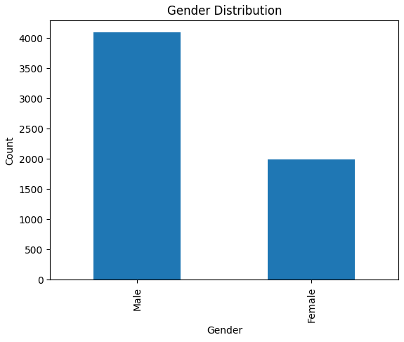
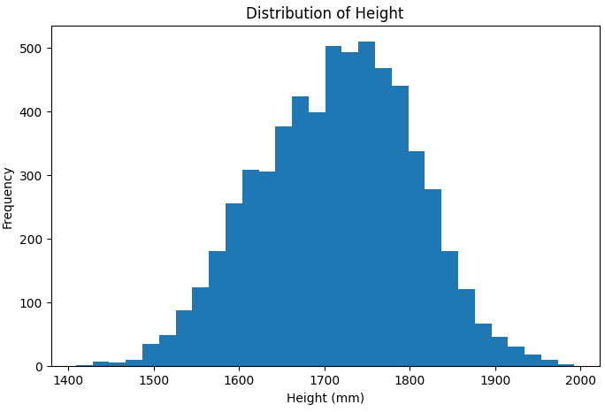
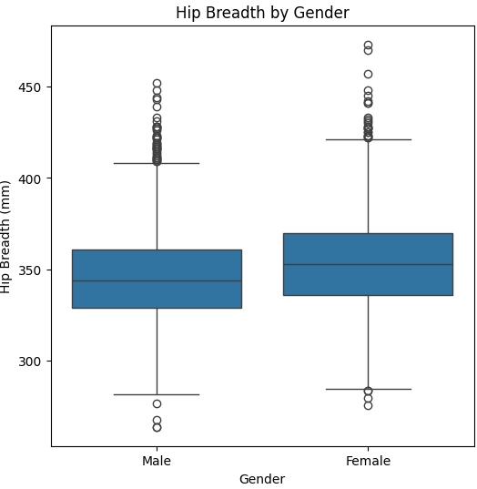

# SmartFit: Clothing Size Recommendation System

## Project Description

SmartFit is a machine learning-based clothing size recommendation system that predicts the most suitable clothing size using anthropometric body measurements. The system aims to improve clothing size selection for online shoppers by providing fast and accurate size recommendations, reducing incorrect purchases and product returns.

---

## Dataset

Dataset Name 

**ANSUR II Survey data**

Source

**https://www.kaggle.com/datasets/seshadrikolluri/ansur-ii**

Dataset Size

- Rows: 6,068
- Columns: 13

## Key Features

- Gender
- Height
- Weight
- Chest Circumference
- Waist Circumference
- Hip Breadth
- Neck Circumference
- Shoulder Circumference
- Arm Length
- Thigh Circumference
- Calf Circumference
- Leg Length
- Clothing Size(**Target variable**)

---

## Tech Stack

### programming language
- Python 3.x

### libraries
- Pandas
- NumPy
- Scikit-learn
- Matplotlib
- Streamlit
- Tableau Public

---

## How to Run

### Clone the repository

```bash
git clone https://github.com/Twyla-art/CLOTHING-SIZE-RECOMMENDATION.git
```

### Navigate to the project folder

```bash
cd "CLOTHING-SIZE-RECOMMENDATION"
```

### Install the required libraries

```bash
pip install -r requirements.txt
```

### Run the Streamlit application

```bash
streamlit run clothing_size.py
```

---


## Exploratory Data Analysis(EDA)
### Gender distribution


### Height Distribution


### Hip Breadth vs Gender


---
## Key Findings

- Decision Tree Classifier achieved the highest prediction accuracy of 98.85%.
- Anthropometric measurements such as height, weight, chest, and waist circumference were strong predictors of clothing size.
- The deployed Streamlit application provides real-time clothing size recommendations.
- Machine learning can significantly improve clothing size prediction and online shopping experiences.

---

## Dashboard


Tableau Public Dashboard

https://public.tableau.com/app/profile/twyla.cherop/viz/SMARTFIT_17860998137010/CLOTHINGSIZERECOMMENDATION?publish=yes

---

## Live Application

A Streamlit web application was developed to enable users to predict the most appropriate clothing size using the trained Decision Tree machine learning model.

Live Application
https://twyla-art-clothing-size-recommendation-clothing-size-wd7yu1.streamlit.app/


---

## Project Presentation

The complete project presentation is available on Canva.

Canva Presentation
https://www.canva.com/design/DAHQ2pNmKMY/xIXdUb3Bvl8F5Js0LTKU8A/edit


---

## Model Performance

| Model | Accuracy |
|--------|----------|
| Baseline (Dummy Classifier) | 29.82% |
| Decision Tree Classifier | 98.85% |
| Random Forest Classifier | 98.68% |

The Baseline (Dummy Classifier) was used as a benchmark to evaluate the performance of the machine learning models. Both Decision Tree and Random Forest classifiers significantly outperformed the baseline. The Decision Tree Classifier achieved the highest prediction accuracy of 98.85% and was selected as the final model for deployment in the Streamlit application.

---
## Project owner
Twyla Cherop

## License

This project is licensed under the MIT License.
